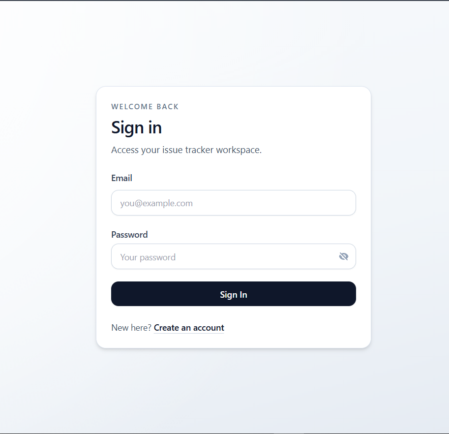
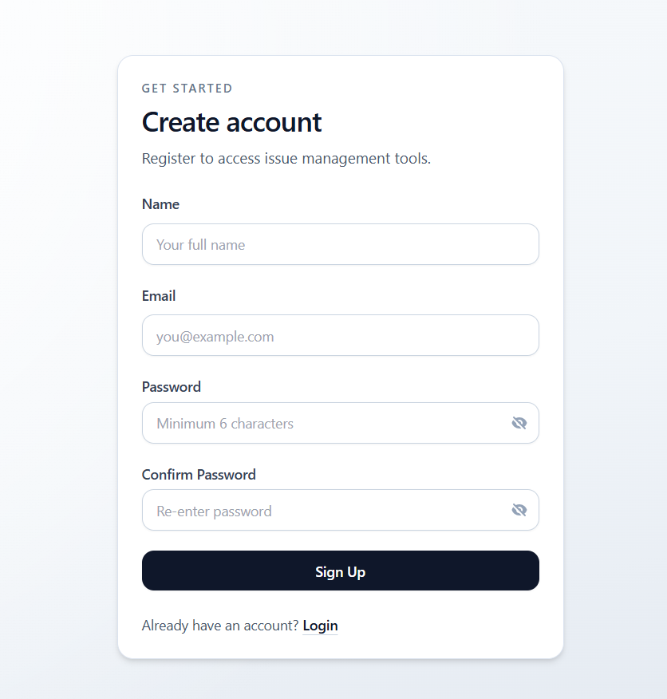
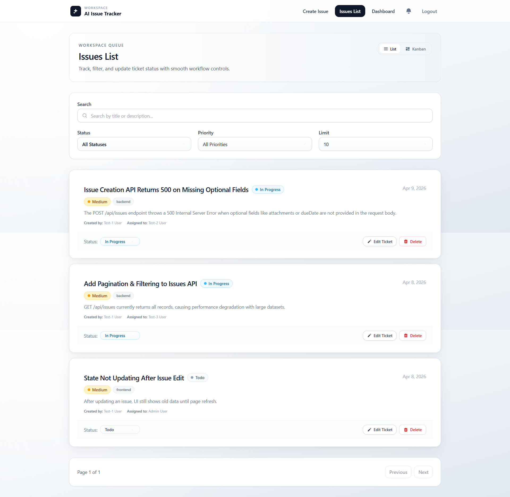
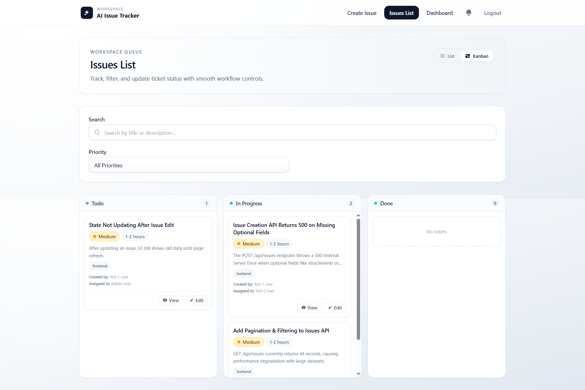
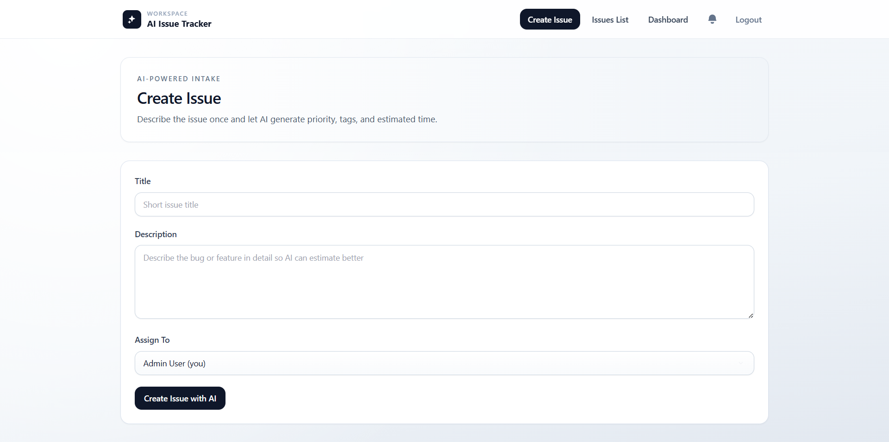
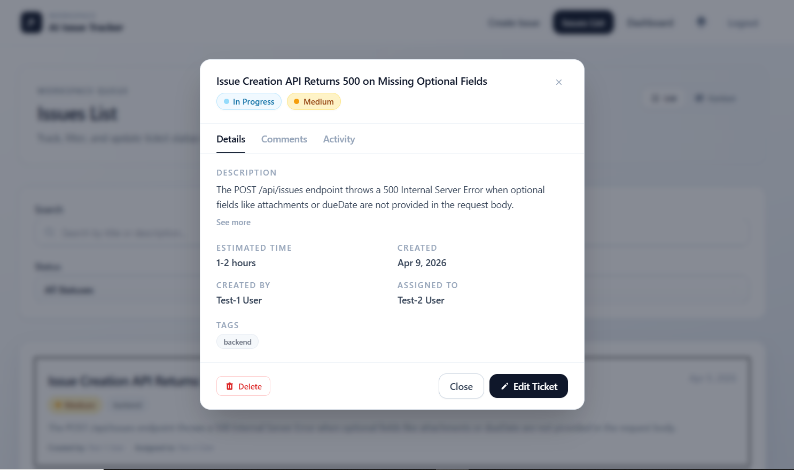
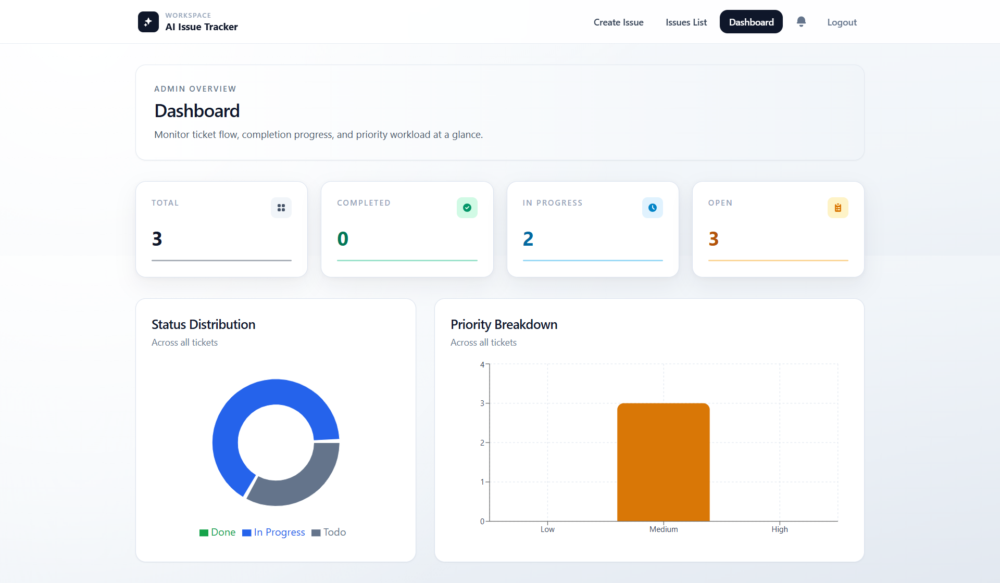
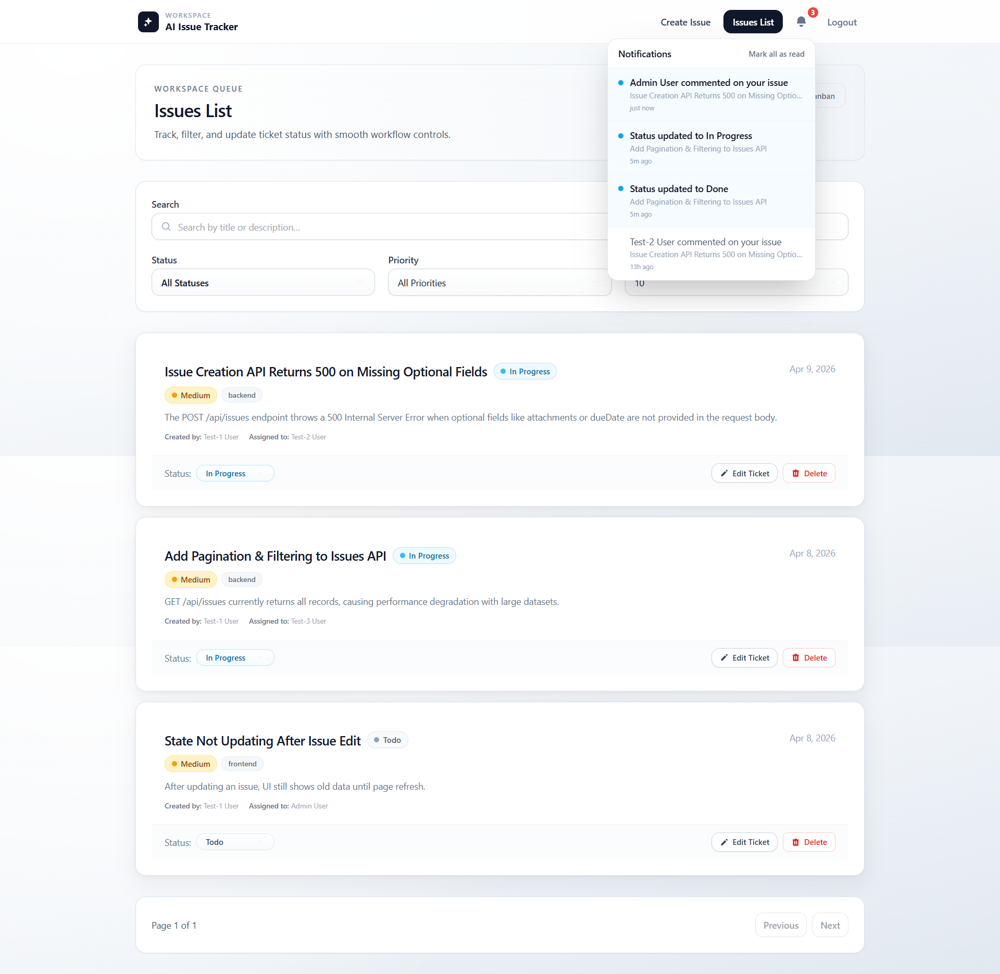

# AI Issue Tracker

> A full-stack AI-powered issue and ticket tracking platform built with the MERN stack. Create tickets, analyze them with OpenAI (or a built-in rule-based fallback), manage workflow on a Kanban board, collaborate with comments, and monitor your team's progress on a real-time admin dashboard.

|                 | Link                                                       |
| --------------- | ---------------------------------------------------------- |
| **Repository**  | https://github.com/abu-raghib-umar-q3tech/ai-issue-tracker |
| **Frontend**    | https://ai-issue-tracker.vercel.app/                       |
| **Backend API** | https://ai-issue-tracker.onrender.com                      |

---

## Table of Contents

- [Live Demo](#live-demo)
- [Overview](#overview)
- [Screenshots](#screenshots)
- [Features](#features)
- [Tech Stack](#tech-stack)
- [Architecture](#architecture)
- [Project Structure](#project-structure)
- [Prerequisites](#prerequisites)
- [Local Development](#local-development)
  - [Backend](#backend)
  - [Frontend](#frontend)
- [Environment Variables](#environment-variables)
  - [Backend (.env)](#backend-env)
  - [Frontend (.env)](#frontend-env)
- [Scripts](#scripts)
- [API Reference](#api-reference)
  - [Auth](#auth)
  - [Tickets](#tickets)
  - [Comments](#comments)
  - [Activity](#activity)
  - [Notifications](#notifications)
  - [Users](#users)
  - [Health](#health)
- [AI Analysis](#ai-analysis)
- [Real-time & Sockets](#real-time--sockets)
- [Role-based Access](#role-based-access)
- [Deployment](#deployment)

---

## Live Demo

|                 | Link                                                                                                             |
| --------------- | ---------------------------------------------------------------------------------------------------------------- |
| **Repository**  | [github.com/abu-raghib-umar-q3tech/ai-issue-tracker](https://github.com/abu-raghib-umar-q3tech/ai-issue-tracker) |
| **Frontend**    | [ai-issue-tracker.vercel.app](https://ai-issue-tracker.vercel.app/)                                              |
| **Backend API** | [ai-issue-tracker.onrender.com](https://ai-issue-tracker.onrender.com)                                           |

---

## Overview

**AI Issue Tracker** lets teams create, prioritize, and resolve tickets faster by integrating AI directly into the ticket-creation flow. When a ticket is submitted, the backend calls the OpenAI Chat API (or a deterministic rule engine when OpenAI is disabled) to automatically suggest:

- **Priority** — `Low`, `Medium`, or `High`
- **Tags** — normalized, deduplicated labels derived from title and description
- **Estimated Time** — a human-readable time estimate

Real-time notifications (Socket.io) keep every team member in sync the moment a ticket is created, updated, or assigned. An admin-only dashboard with bar and pie charts gives managers a live view of ticket distribution by status and priority.

---

## Screenshots

### Login



### Sign Up



### Issues List



### Kanban Board



### Create Ticket



### Ticket Details



### Admin Dashboard



### Notifications



---

## Features

- **Authentication & Authorization** — JWT-based register/login with bcrypt password hashing
- **Role-based Access Control** — `user` and `admin` roles with route-level guards on both frontend and backend
- **Ticket Management** — full CRUD with pagination, search, and filtering by status and priority
- **Kanban Board** — drag-and-drop columns (`Todo` / `In Progress` / `Done`) powered by `@hello-pangea/dnd`
- **AI Ticket Analysis** — one-click analysis returns priority, tags, and time estimate via OpenAI `gpt-4o-mini` (or rule-based fallback)
- **Comments** — threaded comments per ticket
- **Activity Log** — immutable audit trail of every change made to a ticket
- **Real-time Notifications** — Socket.io events pushed to individual user rooms; unread badge in the navbar
- **Admin Dashboard** — metric cards, a priority bar chart, and a status pie chart built with Recharts
- **Issue Tracker** — lightweight issue object (title, description, status, priority) separate from tickets
- **Global Error Handling** — centralized Express error middleware; React Error Boundary on the frontend
- **Skeleton Loading** — polished loading states across all data-fetching flows

---

## Tech Stack

### Frontend

| Library                   | Version | Purpose                      |
| ------------------------- | ------- | ---------------------------- |
| React                     | 18      | UI framework                 |
| Vite                      | 5       | Build tool & dev server      |
| TypeScript                | 6       | Static typing                |
| Tailwind CSS              | 3       | Utility-first styling        |
| Redux Toolkit + RTK Query | 2       | Global state & data fetching |
| React Router              | 7       | Client-side routing          |
| Socket.io-client          | 4       | Real-time events             |
| Recharts                  | 3       | Dashboard charts             |
| @hello-pangea/dnd         | 18      | Drag-and-drop Kanban         |
| React Toastify            | 11      | Toast notifications          |

### Backend

| Library            | Version | Purpose                    |
| ------------------ | ------- | -------------------------- |
| Node.js + Express  | 4       | HTTP server                |
| TypeScript         | 6       | Static typing              |
| MongoDB + Mongoose | 8       | Database & ODM             |
| JSON Web Token     | 9       | Authentication             |
| bcryptjs           | 3       | Password hashing           |
| Socket.io          | 4       | Real-time WebSocket server |
| OpenAI REST API    | —       | AI ticket analysis         |
| tsx                | 4       | TypeScript execution (dev) |

---

## Architecture

```
┌─────────────────────────┐        HTTP / REST        ┌──────────────────────────┐
│                         │ ◄────────────────────────► │                          │
│   React SPA (Vite)      │                           │   Express API (Node.js)  │
│   Redux Toolkit /       │        WebSocket          │   JWT Auth Middleware    │
│   RTK Query             │ ◄────────────────────────► │   Socket.io Server       │
│                         │                           │                          │
└─────────────────────────┘                           └──────────┬───────────────┘
                                                                  │
                                                       ┌──────────▼───────────────┐
                                                       │      MongoDB Atlas /      │
                                                       │      Local MongoDB        │
                                                       └──────────────────────────┘
                                                                  │
                                                       ┌──────────▼───────────────┐
                                                       │   OpenAI Chat API        │
                                                       │   (optional, gpt-4o-mini)│
                                                       └──────────────────────────┘
```

---

## Project Structure

```
AI-Issue Tracker/
├── backend/
│   ├── src/
│   │   ├── app.ts                  # Express app setup, CORS, routes
│   │   ├── server.ts               # HTTP server + Socket.io bootstrap
│   │   ├── config/
│   │   │   ├── db.ts               # Mongoose connection
│   │   │   ├── env.ts              # Typed environment config
│   │   │   └── socket.ts           # Socket.io server init & room logic
│   │   ├── controllers/            # Request handlers (thin, delegate to services)
│   │   ├── middleware/
│   │   │   ├── authenticateUser.ts # JWT verification → req.user
│   │   │   ├── errorHandler.ts     # Global Express error handler
│   │   │   └── notFound.ts         # 404 handler
│   │   ├── models/                 # Mongoose schemas & types
│   │   ├── routes/                 # Express routers
│   │   ├── services/               # Business logic layer
│   │   │   └── ai.service.ts       # OpenAI + rule-based fallback
│   │   ├── types/                  # Shared TypeScript interfaces
│   │   └── utils/
│   │       ├── asyncHandler.ts     # Wraps async route handlers
│   │       ├── createNotification.ts
│   │       └── logActivity.ts
│   ├── package.json
│   └── tsconfig.json
│
└── frontend/
    ├── src/
    │   ├── App.tsx                 # Route definitions & auth guards
    │   ├── app/
    │   │   ├── store.ts            # Redux store
    │   │   └── hooks.ts            # Typed useAppDispatch / useAppSelector
    │   ├── components/ui/          # Shared UI: Kanban, Modals, Skeleton, etc.
    │   ├── features/               # RTK Query slices & domain types
    │   │   ├── auth/               # Login, register, JWT storage
    │   │   ├── tickets/            # Ticket CRUD + AI analyze endpoint
    │   │   ├── comments/
    │   │   ├── notifications/
    │   │   ├── activity/
    │   │   └── users/
    │   ├── hooks/                  # useDebounce, useSocketEvents, etc.
    │   ├── layouts/                # GlobalLayout (navbar, sidebar)
    │   ├── pages/                  # Route-level page components
    │   └── services/
    │       ├── baseApi.ts          # RTK Query base with auth header
    │       └── socket.ts           # Socket.io client singleton
    ├── index.html
    ├── vite.config.ts
    ├── tailwind.config.js
    └── vercel.json                 # SPA rewrite rule for Vercel
```

---

## Prerequisites

- **Node.js** ≥ 18
- **npm** ≥ 9
- **MongoDB** — local instance (`mongodb://127.0.0.1:27017`) **or** a MongoDB Atlas URI
- **OpenAI API key** — optional; the app falls back to rule-based analysis when `USE_OPENAI=false`

---

## Local Development

### Backend

```bash
cd backend
npm install
cp .env.example .env   # then fill in the values (see Environment Variables below)
npm run dev
```

The API server starts at **`http://localhost:5001`**.

### Frontend

```bash
cd frontend
npm install
cp .env.example .env   # set VITE_API_URL=http://localhost:5001/api
npm run dev
```

The dev server starts at **`http://localhost:5173`**.

Open both terminals simultaneously. The frontend proxies all API calls to the backend via `VITE_API_URL`.

---

## Environment Variables

### Backend (`.env`)

| Variable         | Required    | Default                                      | Description                                   |
| ---------------- | ----------- | -------------------------------------------- | --------------------------------------------- |
| `NODE_ENV`       | No          | `development`                                | Runtime environment                           |
| `PORT`           | No          | `5001`                                       | HTTP port                                     |
| `MONGO_URI`      | Yes         | `mongodb://127.0.0.1:27017/ai_issue_tracker` | MongoDB connection string                     |
| `CLIENT_URL`     | Yes         | `http://localhost:5173`                      | Allowed CORS origin (frontend URL)            |
| `JWT_SECRET`     | **Yes**     | `change_me_in_production`                    | JWT signing secret — **change in production** |
| `JWT_EXPIRES_IN` | No          | `1d`                                         | JWT expiry (e.g. `7d`, `24h`)                 |
| `USE_OPENAI`     | No          | `false`                                      | Set to `true` to enable OpenAI analysis       |
| `OPENAI_API_KEY` | Conditional | —                                            | Required when `USE_OPENAI=true`               |
| `OPENAI_MODEL`   | No          | `gpt-4o-mini`                                | OpenAI model identifier                       |

### Frontend (`.env`)

| Variable       | Required             | Default                     | Description          |
| -------------- | -------------------- | --------------------------- | -------------------- |
| `VITE_API_URL` | **Yes** (production) | `http://localhost:5001/api` | Backend API base URL |

> In development the frontend falls back to `http://localhost:5001/api` automatically when `VITE_API_URL` is not set.

---

## Scripts

### Backend

| Script              | Description                                     |
| ------------------- | ----------------------------------------------- |
| `npm run dev`       | Start the server in watch mode with `tsx watch` |
| `npm run build`     | Compile TypeScript → `dist/`                    |
| `npm start`         | Run the compiled server from `dist/server.js`   |
| `npm run typecheck` | Run `tsc --noEmit` (type-check only)            |

### Frontend

| Script              | Description                          |
| ------------------- | ------------------------------------ |
| `npm run dev`       | Start Vite dev server                |
| `npm run build`     | Production build → `dist/`           |
| `npm run preview`   | Preview the production build locally |
| `npm run typecheck` | Run `tsc --noEmit` (type-check only) |

---

## API Reference

All protected routes require the `Authorization: Bearer <token>` header.

### Auth

| Method | Path                 | Auth   | Description              |
| ------ | -------------------- | ------ | ------------------------ |
| `POST` | `/api/auth/register` | Public | Create a new account     |
| `POST` | `/api/auth/login`    | Public | Log in and receive a JWT |

**Register body**

```json
{ "name": "Jane Doe", "email": "jane@example.com", "password": "secret" }
```

**Login body**

```json
{ "email": "jane@example.com", "password": "secret" }
```

**Login response**

```json
{
  "token": "<jwt>",
  "user": {
    "id": "...",
    "name": "Jane Doe",
    "email": "jane@example.com",
    "role": "user"
  }
}
```

---

### Tickets

| Method   | Path                   | Auth         | Description                          |
| -------- | ---------------------- | ------------ | ------------------------------------ |
| `GET`    | `/api/tickets`         | User         | List tickets (paginated, filterable) |
| `POST`   | `/api/tickets`         | User         | Create a ticket                      |
| `POST`   | `/api/tickets/analyze` | User         | AI-analyze a ticket draft            |
| `GET`    | `/api/tickets/:id`     | User         | Get a single ticket                  |
| `PUT`    | `/api/tickets/:id`     | User / Admin | Update a ticket                      |
| `DELETE` | `/api/tickets/:id`     | User / Admin | Delete a ticket                      |

**GET `/api/tickets` query parameters**

| Parameter  | Type                          | Default | Description                           |
| ---------- | ----------------------------- | ------- | ------------------------------------- |
| `page`     | number                        | `1`     | Page number                           |
| `limit`    | number                        | `10`    | Items per page                        |
| `status`   | `Todo \| In Progress \| Done` | —       | Filter by status                      |
| `priority` | `Low \| Medium \| High`       | —       | Filter by priority                    |
| `search`   | string                        | —       | Full-text search on title/description |

**Create ticket body**

```json
{
  "title": "Login button unresponsive on mobile",
  "description": "Tapping the login button on iOS Safari does nothing.",
  "priority": "High",
  "tags": ["frontend", "bug"],
  "estimatedTime": "2-4 hours"
}
```

**Analyze ticket body (`POST /api/tickets/analyze`)**

```json
{
  "title": "App crashes on startup",
  "description": "Crash occurs after the latest update."
}
```

**Analyze ticket response**

```json
{ "priority": "High", "tags": ["bug", "crash"], "estimatedTime": "4-8 hours" }
```

---

### Comments

| Method | Path                      | Auth | Description                     |
| ------ | ------------------------- | ---- | ------------------------------- |
| `GET`  | `/api/comments/:ticketId` | User | Fetch all comments for a ticket |
| `POST` | `/api/comments`           | User | Post a comment on a ticket      |

---

### Activity

| Method | Path                      | Auth | Description                         |
| ------ | ------------------------- | ---- | ----------------------------------- |
| `GET`  | `/api/activity/:ticketId` | User | Fetch the activity log for a ticket |

---

### Notifications

| Method | Path                          | Auth | Description                                        |
| ------ | ----------------------------- | ---- | -------------------------------------------------- |
| `GET`  | `/api/notifications`          | User | Fetch paginated notifications for the current user |
| `PUT`  | `/api/notifications/read-all` | User | Mark all notifications as read                     |
| `PUT`  | `/api/notifications/:id/read` | User | Mark a single notification as read                 |

---

### Users

| Method | Path         | Auth | Description                               |
| ------ | ------------ | ---- | ----------------------------------------- |
| `GET`  | `/api/users` | User | List all users (for assignment dropdowns) |

---

### Health

| Method | Path          | Auth   | Description                  |
| ------ | ------------- | ------ | ---------------------------- |
| `GET`  | `/api/health` | Public | Returns `{ "status": "ok" }` |

---

## AI Analysis

The AI analysis pipeline lives in `backend/src/services/ai.service.ts` and works in two modes controlled by the `USE_OPENAI` environment variable.

### OpenAI mode (`USE_OPENAI=true`)

Sends the ticket title and description to `POST https://api.openai.com/v1/chat/completions` using the model specified in `OPENAI_MODEL` (default `gpt-4o-mini`). The system prompt instructs the model to return strict JSON:

```json
{ "priority": "Low|Medium|High", "tags": ["string"], "estimatedTime": "string" }
```

The response is sanitised (strips markdown code fences), JSON-parsed, and validated before being returned to the client.

### Rule-based fallback (`USE_OPENAI=false` or API error)

A lightweight regex engine inspects the combined title + description:

| Condition                    | Result                                                              |
| ---------------------------- | ------------------------------------------------------------------- |
| Contains `crash` or `urgent` | `priority: High`                                                    |
| Contains `ui`                | adds tag `frontend`                                                 |
| Contains `api`               | adds tag `backend`                                                  |
| Contains `bug`               | adds tag `bug`, `estimatedTime: 2-4 hours`                          |
| No match                     | `priority: Medium`, tags: `["general"]`, `estimatedTime: 1-2 hours` |

Tags are always lower-cased, trimmed, and deduplicated.

---

## Real-time & Sockets

Socket.io is initialised in `backend/src/config/socket.ts` and attached to the HTTP server at startup.

- On connection, the frontend emits a `join` event with the user's ID to subscribe to a **private room**.
- The backend emits targeted events (e.g. `notification:new`) to that room whenever a relevant action occurs.
- The frontend listens for these events inside the `useSocketEvents` hook and dispatches RTK Query cache invalidations to trigger a re-fetch without polling.

---

## Role-based Access

| Feature                | `user`          | `admin` |
| ---------------------- | --------------- | ------- |
| View tickets           | Own + assigned  | All     |
| Create ticket          | ✅              | ✅      |
| Update / delete ticket | Own or assigned | All     |
| View dashboard         | ❌              | ✅      |
| List all users         | ✅              | ✅      |

Route-level guards are enforced on both the Express middleware layer (`authenticateUser` + role checks in service layer) and the React router (`RequireAuth` / `RequireAdmin` wrapper components).

---

## Deployment

### Frontend — Vercel

The `vercel.json` at the frontend root rewrites all paths to `index.html` for client-side routing:

```json
{ "rewrites": [{ "source": "/(.*)", "destination": "/index.html" }] }
```

Set the `VITE_API_URL` environment variable in the Vercel project settings to point to your deployed backend URL.

### Backend — Any Node.js Host (Render, Railway, Fly.io, etc.)

```bash
cd backend
npm run build   # compiles TypeScript → dist/
npm start       # runs dist/server.js
```

Set all [backend environment variables](#backend-env) in the host's secrets manager. Ensure `CLIENT_URL` matches your deployed frontend URL to avoid CORS errors.

### Database

Use **MongoDB Atlas** for a managed cloud database. Copy the connection string into `MONGO_URI`. The application connects automatically on startup via `backend/src/config/db.ts`.
